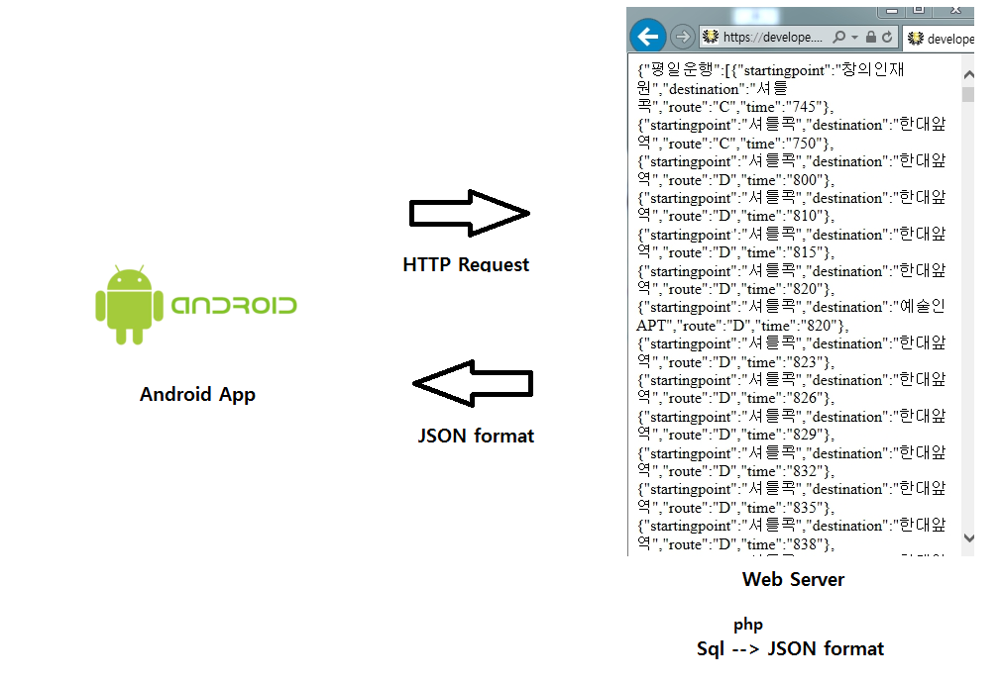

# Brief Structure

------------
## Brief Structure

This project develop __Android Application__ using __[Android Studio](https://developer.android.com/studio)__ which informs timetable of shuttle bus . Application imports data from an independent database.

Database is constructed and maintained through __[MariaDB](https://mariadb.org/)__. Database has information of staringpoint, destination, route and time corresponding to each shuttle bus.

Application does not import data from database directly. It imports data as JSON(JavaScript Object Notation) format.

Data from database is expressed in JSON format on web through __[Apache Web Server](https://httpd.apache.org/)__ and __[php](https://www.php.net/)__. Android application gets it from web and represent as timetable.

------------
## Source Codes

